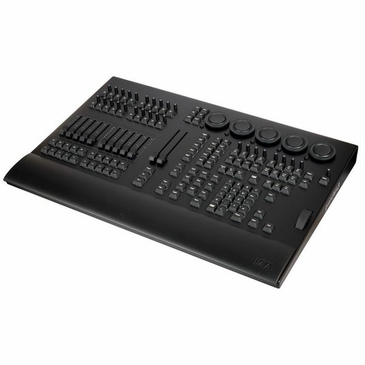
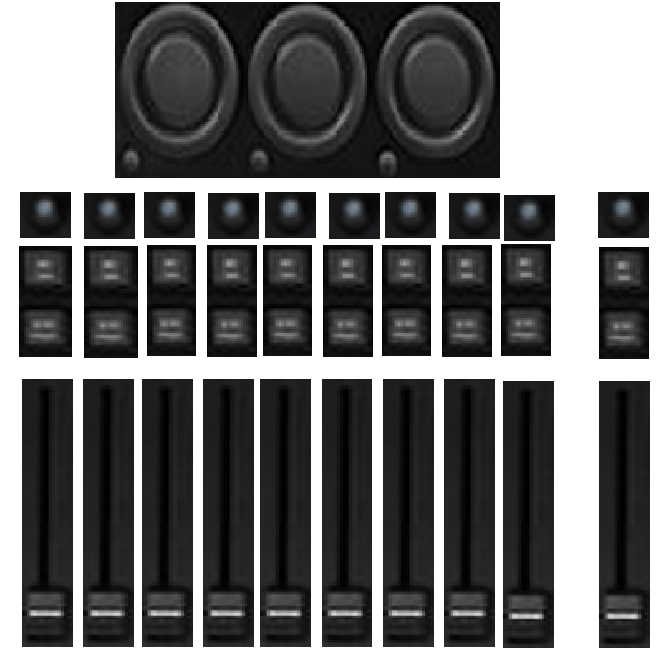

| title | MIDI-controller-DIY |
| --- | --- |
| author | GLOXIOU |
| description | A DIY project for a MIDI controller designed to control lights, featuring knobs, faders, and buttons. |
| created_at | 2026-09-23 |

# Day 1: Defining system & idea search & inspiration

I want to make a MIDI controlleur to control my lights via my already made [DMX Unit](https://github.com/GLOXIOU/DMX-Unit-DIY), with 9 faders, 1 master fader, for all of the faders, 2 keyboards low profile key, and 2 potentiometer. I also want 2 larger rotary encoders with push-button function. All of that in a box, designed in 3D in Fusion 360, and for the first time in my life with a PCB. All of that will be managed by an ESP32-S3, and I want just a USB-C output for the MIDI.

My inspiration is the GrandMa, wich cost around 7000$. I want to make that, but for much cheaper, and with just the functionality I need. The only thing I want to keep from that housing is the utility.

So I started by making a litlle schema of what I want and what I imagine:

Why 9 faders and 1 master ? Beacause on Aliexpress, tehre's only lots of 10 pieces. But that might changes, like maybe I will add 5 or I don't know. For the parts, I check online and talk to some friends, and apprenntly, this is the best:

* SC1009G Fader 10K Ohms x10
* EC11 rotary encoder x3 (I need to make the large wheel above the potentiometer in 3D)
* WH148 10K omhs x10
* Kailh 1350 Choc V1 - Brown switch x10

For a price arround 50 dollars with the PCB I believe, but it's need to be confirmed. The last time I order on aliexpress, I payed duble the price beacause of the importation tax in europe, so I need to be carefull this time...

Nothing is finished yet, but here is where the project stands at this point. Now that I have all this, I think the first step will be to design the PCB, so I can then create the 3D enclosure and finally work on the code.

Here's the actual BOM without the PCB, and the componments may changed.

| Componment | Price |
| --- | --- |
| [SC1009G x10](https://fr.aliexpress.com/item/1005005672998771.html?spm=a2g0o.detail.0.0.201bK7KcK7KcXm&mp=1&pdp_npi=6%40dis%21USD%21USD+1.30%21USD+1.30%21%21USD+1.30%21%21%21%402103877917901810379314752e0e85%2112000033969264277%21ct%21FR%218054027548%21%2110%210%21&gatewayAdapt=glo2fra) | 13$ (1,30/u) |
| [EC11 x5](https://fr.aliexpress.com/item/1005006076665259.html?spm=a2g0o.productlist.main.5.726c744cddS8oW&algo_pvid=36768314-8438-4adb-a4e7-6090b5166267&algo_exp_id=36768314-8438-4adb-a4e7-6090b5166267-4&pdp_ext_f=%7B%22order%22%3A%2297%22%2C%22eval%22%3A%221%22%2C%22fromPage%22%3A%22search%22%7D&pdp_npi=6%40dis%21USD%213.71%213.71%21%21%213.71%213.71%21%40210396b417901810117431279e0f8e%2112000035620500850%21sea%21FR%218054027548%21X%211%210%21n_tag%3A-29911%3Bd%3A8484f755%3Bm03_new_user%3A-29895&curPageLogUid=hNYpQEoSuQne&utparam-url=scene%3Asearch%7Cquery_from%3A%7Cx_object_id%3A1005006076665259%7C_p_origin_prod%3A) | 3,71$ (0,74$/u) |
| [WH148 10K x10](https://fr.aliexpress.com/item/1005002490613561.html?spm=a2g0o.productlist.main.1.599e19c9i15Tbc&algo_pvid=aca01da4-118c-4022-90e6-e5c8dab1be97&algo_exp_id=aca01da4-118c-4022-90e6-e5c8dab1be97-0&pdp_ext_f=%7B%22order%22%3A%22717%22%2C%22eval%22%3A%221%22%2C%22fromPage%22%3A%22search%22%7D&pdp_npi=6%40dis%21USD%212.48%212.48%21%21%212.48%212.48%21%400b88ad2b17901811376188011e138c%2112000020849751252%21sea%21FR%218054027548%21X%211%210%21n_tag%3A-29911%3Bd%3A8484f755%3Bm03_new_user%3A-29895&curPageLogUid=8UOI0kTEd6Tb&utparam-url=scene%3Asearch%7Cquery_from%3A%7Cx_object_id%3A1005002490613561%7C_p_origin_prod%3A) | 4,96$ (0,49$/u) |
| [Kailh 1350 Choc V1](https://fr.aliexpress.com/item/1005012826040037.html?spm=a2g0o.productlist.main.2.3e1975b5vn9tCl&algo_pvid=ff654489-4542-47fd-9dfc-b9361233fe1a&algo_exp_id=ff654489-4542-47fd-9dfc-b9361233fe1a-1&pdp_ext_f=%7B%22order%22%3A%2287%22%2C%22spu_best_type%22%3A%22price%22%2C%22eval%22%3A%221%22%2C%22fromPage%22%3A%22search%22%7D&pdp_npi=6%40dis%21USD%2116.20%2116.20%21%21%2116.20%2116.20%21%402103849717901812322673309e11d2%2112000059425505110%21sea%21FR%218054027548%21X%211%210%21n_tag%3A-29911%3Bd%3A8484f755%3Bm03_new_user%3A-29895&curPageLogUid=phBADeuojBpp&utparam-url=scene%3Asearch%7Cquery_from%3A%7Cx_object_id%3A1005012826040037%7C_p_origin_prod%3A) | 10,72$ (1,07$/u) |
| Deliverie/Importation | 16,14$ |
| Total | 60,11$ |

To that, we need to add the keycaps for the 10 keyboard key, and the PCB. ~+20$, so the total for now is around 80 dollars.

**Total time spent: 2 hours**